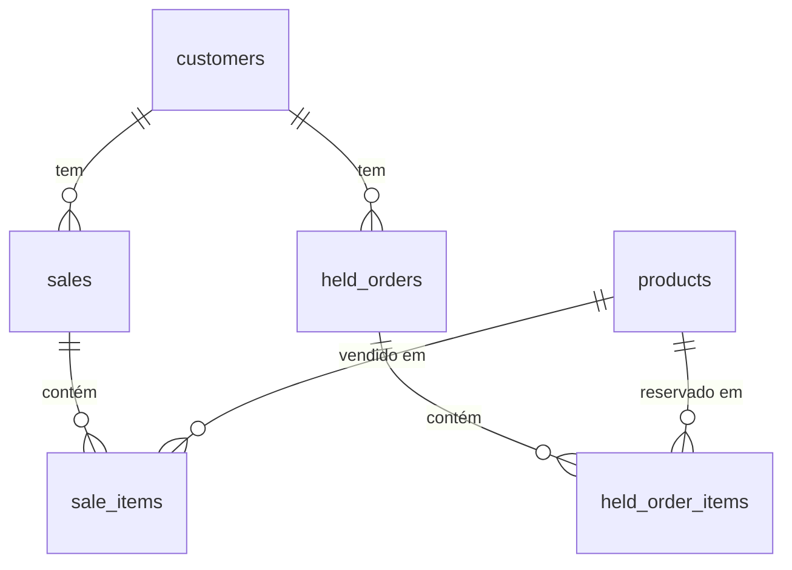

# 🍺 Meu Bar - Guia de Instalação Completo

## Índice

- [Pré-requisitos](#pré-requisitos)
- [Instalação Rápida via curl](#instalação-rápida-via-curl)
- [Instalação Manual](#instalação-manual)
- [Banco de Dados](#banco-de-dados)
- [Configuração](#configuração)
- [Comandos Úteis](#comandos-úteis)

---

## Pré-requisitos

| Requisito | Versão Mínima |
|-----------|--------------|
| Sistema Operacional | Debian/Ubuntu |
| Node.js | 18+ (instalado automaticamente) |
| PostgreSQL | 12+ (instalado automaticamente) |
| Python 3 | Para o servidor HTTP de instalação |

---

## Instalação Rápida via curl

### No servidor de origem (esta máquina)

```bash
# Torne o script executável (apenas uma vez)
chmod +x serve_install.sh

# Inicie o servidor de instalação
./serve_install.sh
```

Isso exibirá o comando `curl` que deve ser executado no cliente.

### Na máquina destino (cliente)

```bash
curl -fsSL http://192.168.88.235:8000/install.sh | sudo bash
```

O script instala automaticamente:
- ✅ Node.js 20 LTS
- ✅ PostgreSQL e configuração do banco
- ✅ Dependências NPM (frontend + backend)
- ✅ Build do frontend
- ✅ Serviço systemd para o backend

---

## Instalação Manual

### 1. Instalar Node.js 20

```bash
curl -fsSL https://deb.nodesource.com/setup_20.x | sudo bash -
sudo apt-get install -y nodejs
```

### 2. Instalar e configurar PostgreSQL

```bash
sudo apt-get install -y postgresql postgresql-contrib
sudo systemctl enable postgresql
sudo systemctl start postgresql
```

### 3. Criar banco de dados

```bash
sudo -u postgres psql <<EOF
CREATE ROLE dbadmin WITH LOGIN PASSWORD 'dbadmin';
CREATE DATABASE meubar_db OWNER dbadmin;
GRANT ALL PRIVILEGES ON DATABASE meubar_db TO dbadmin;
EOF
```

### 4. Clonar e configurar o projeto

```bash
sudo mkdir -p /opt/meu-bar
# Copie os arquivos do projeto para /opt/meu-bar

# Configurar .env do backend
cat > /opt/meu-bar/backend/.env <<EOF
DB_USER=dbadmin
DB_PASSWORD=dbadmin
DB_HOST=localhost
DB_NAME=meubar_db
DB_PORT=5432
PORT=3001
EOF
```

### 5. Instalar dependências e compilar

```bash
cd /opt/meu-bar
npm install

cd /opt/meu-bar/backend
npm install

cd /opt/meu-bar
npx vite build --outDir dist
```

### 6. Iniciar o backend

```bash
cd /opt/meu-bar/backend
npx ts-node server.ts
```

---

## Banco de Dados

### Informações de Conexão

| Parâmetro | Valor |
|-----------|-------|
| Host | `localhost` |
| Porta | `5432` |
| Banco | `meubar_db` |
| Usuário | `dbadmin` |
| Senha | `dbadmin` |

### Esquema de Tabelas

As tabelas são criadas automaticamente ao iniciar o backend. Esquema completo:

#### `users` - Usuários do sistema
| Coluna | Tipo | Restrições |
|--------|------|-----------|
| id | SERIAL | PRIMARY KEY |
| name | VARCHAR(255) | NOT NULL |
| email | VARCHAR(255) | UNIQUE, NOT NULL |
| password | VARCHAR(255) | NOT NULL |

#### `customers` - Clientes
| Coluna | Tipo | Restrições |
|--------|------|-----------|
| id | SERIAL | PRIMARY KEY |
| name | VARCHAR(255) | NOT NULL |
| phone | VARCHAR(50) | - |

#### `products` - Produtos
| Coluna | Tipo | Restrições |
|--------|------|-----------|
| id | SERIAL | PRIMARY KEY |
| name | VARCHAR(255) | NOT NULL |
| category | VARCHAR(100) | NOT NULL |
| price | DECIMAL(10,2) | NOT NULL |
| stock | INTEGER | NOT NULL, DEFAULT 0 |

#### `sales` - Vendas
| Coluna | Tipo | Restrições |
|--------|------|-----------|
| id | SERIAL | PRIMARY KEY |
| customer_id | INTEGER | FK → customers(id) |
| date | TIMESTAMP | DEFAULT CURRENT_TIMESTAMP |
| total | DECIMAL(10,2) | NOT NULL |
| payment_method | VARCHAR(50) | - |
| payment_status | VARCHAR(50) | - |

#### `sale_items` - Itens da Venda
| Coluna | Tipo | Restrições |
|--------|------|-----------|
| id | SERIAL | PRIMARY KEY |
| sale_id | INTEGER | FK → sales(id) ON DELETE CASCADE |
| product_id | INTEGER | FK → products(id) |
| quantity | INTEGER | NOT NULL |
| subtotal | DECIMAL(10,2) | NOT NULL |

#### `held_orders` - Pedidos em Espera
| Coluna | Tipo | Restrições |
|--------|------|-----------|
| id | SERIAL | PRIMARY KEY |
| customer_id | INTEGER | FK → customers(id) |
| total | DECIMAL(10,2) | NOT NULL |
| held_at | TIMESTAMP | DEFAULT CURRENT_TIMESTAMP |

#### `held_order_items` - Itens dos Pedidos em Espera
| Coluna | Tipo | Restrições |
|--------|------|-----------|
| id | SERIAL | PRIMARY KEY |
| held_order_id | INTEGER | FK → held_orders(id) ON DELETE CASCADE |
| product_id | INTEGER | FK → products(id) |
| quantity | INTEGER | NOT NULL |
| subtotal | DECIMAL(10,2) | NOT NULL |

#### `bar_info` - Informações do Bar
| Coluna | Tipo | Restrições |
|--------|------|-----------|
| id | SERIAL | PRIMARY KEY |
| name | VARCHAR(255) | - |
| email | VARCHAR(255) | - |
| phone | VARCHAR(50) | - |
| address | TEXT | - |

> **Nota:** A tabela `bar_info` é populada automaticamente com dados padrão na primeira execução.

### Diagrama de Relacionamentos



---

## Configuração

### Variáveis de Ambiente (backend/.env)

| Variável | Descrição | Padrão |
|----------|-----------|--------|
| `DB_USER` | Usuário do PostgreSQL | `dbadmin` |
| `DB_PASSWORD` | Senha do PostgreSQL | `dbadmin` |
| `DB_HOST` | Host do PostgreSQL | `localhost` |
| `DB_NAME` | Nome do banco | `meubar_db` |
| `DB_PORT` | Porta do PostgreSQL | `5432` |
| `PORT` | Porta do backend | `3001` |

### Portas Utilizadas

| Serviço | Porta |
|---------|-------|
| Frontend (Vite dev) | 3000 |
| Backend (Express API) | 3001 |
| PostgreSQL | 5432 |

---

## Comandos Úteis

```bash
# Verificar status do backend
sudo systemctl status meu-bar-backend

# Reiniciar backend
sudo systemctl restart meu-bar-backend

# Ver logs do backend
sudo journalctl -u meu-bar-backend -f

# Acessar o banco de dados
psql -U dbadmin -d meubar_db -h localhost

# Desenvolvimento (frontend)
cd /opt/meu-bar && npm run dev

# Desenvolvimento (backend)
cd /opt/meu-bar/backend && npm run dev
```
